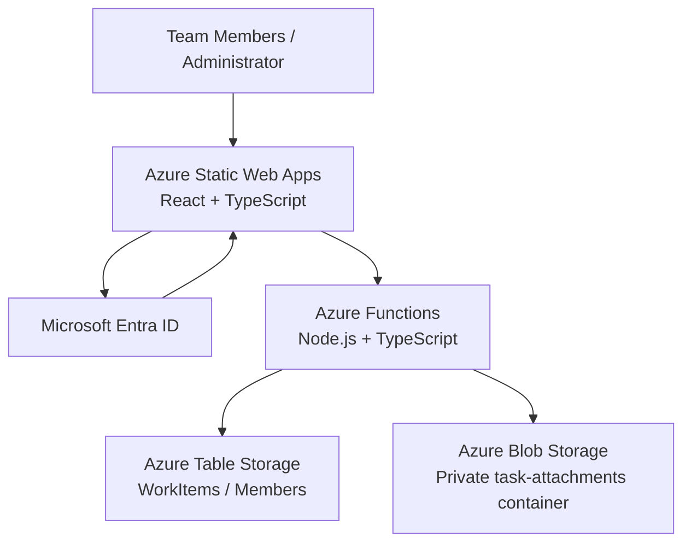
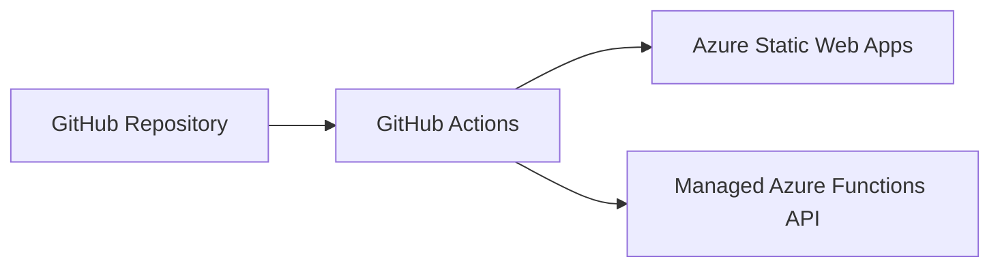

# Team Workload App — Solution Architecture

## 1. Overview

The Azure Team Workload App is a lightweight, serverless application for assigning tasks, balancing team workloads and maintaining task histories.

The architecture uses Azure-managed services to minimize operational overhead and avoid maintaining dedicated application servers.

## 2. Architecture Diagram

## 3. Architecture Components

| Component | Responsibility |
|---|---|
| React frontend | Dashboard, task forms, task details and member administration |
| Azure Static Web Apps | Hosts the frontend and provides managed authentication |
| Microsoft Entra ID | Authenticates users with Microsoft identities |
| Azure Functions | Implements APIs, authorization and business logic |
| Azure Table Storage | Stores task entities, membership records and task history |
| Azure Blob Storage | Stores task attachments in a private container |
| GitHub Actions | Builds and deploys the application |

The frontend communicates with the backend using `/api/*` routes.

## 4. Authentication and Authorization

Authentication is handled by Azure Static Web Apps using Microsoft Entra ID.

The API uses the authenticated `x-ms-client-principal` header supplied through the trusted Static Web Apps integration.

Each protected API operation validates the user's role and checks the corresponding record in the `Members` table.

**Application access requires:**

- An authenticated Microsoft identity
- An authorized SWA role (`member` or `admin`)
- A matching application membership record
- `Enabled` set to Boolean `true`

Administrators can manage members, but cannot disable their own accounts through the management API.

Disabled members are denied access to protected APIs even if an existing Microsoft authentication session remains valid.

**Security boundary:** The backend must remain accessible only through its trusted SWA-managed API integration. Direct exposure of the Functions host would undermine trust in client-principal headers.

## 5. Data Architecture

### WorkItems table

The `WorkItems` table uses partition `team:default` and stores tasks and task-history events.

Task data includes:

- Task ID and title
- Description and note
- Owner and status
- In Scope classification
- Creation and modification metadata
- Archive and completion information

Task-history events record supported changes, including changes in ownership, status, scope, notes and descriptions.

### Members table

The `Members` table stores application membership information.

| Property | Purpose |
|---|---|
| PartitionKey | Team partition |
| RowKey | SWA principal user ID |
| MemberId | Application membership identifier |
| DisplayName | Name displayed in the application |
| Enabled | Boolean controlling application access |

The administrator may enable or disable a member without deleting their existing task records.

### Azure Blob Storage

Attachments are stored in the private `task-attachments` Blob container.

The application supports up to five attachments per task, with a maximum size of 5 MB per attachment.

Attachment listing, upload, preview, download and deletion are handled through protected backend operations.

## 6. Application Flows

### Viewing tasks

1. User signs in through Azure Static Web Apps.
2. The frontend verifies application access.
3. React requests task and member information from Azure Functions.
4. The backend validates authentication and membership.
5. The backend queries Azure Table Storage.
6. The frontend displays task and workload information.

### Updating a task

1. A user submits a permitted task change.
2. The frontend sends the request to the appropriate API.
3. Azure Functions validates authorization.
4. The backend updates the task, using concurrency checks where implemented.
5. The frontend refreshes the task data.

### Disabling a member

1. An administrator opens Member Management.
2. The administrator disables the selected member.
3. Azure Functions checks administrator authorization.
4. The backend updates the member's `Enabled` property to `false`.
5. Subsequent protected API requests from that member are denied.

The account's Microsoft identity and SWA invitation are not automatically removed.

## 7. Deployment Architecture

Source code is stored in GitHub.

Deployment is performed using a manually triggered GitHub Actions workflow.

The workflow builds both the frontend and API.

The existing production deployment uses:

- Resource group: `rg-team-workload-dev`
- Static Web App: `swa-team-workload-dev`
- Storage account: `stteamworkload85131`
- Region: East Asia

Deployment does not intentionally recreate the storage tables or erase existing task data.

## 8. Local Development

The local environment uses:

- Vite for React development
- Azure Functions Core Tools for backend execution
- Azurite for local Table and Blob Storage
- Azure Static Web Apps CLI for local gateway and authentication emulation

The primary local application URL is:

`http://localhost:4280`

Use the SWA emulator for integrated testing so requests follow the expected authentication path.

## 9. Availability and Operational Considerations

This application uses managed, serverless Azure services, reducing the need for VM patching, operating-system administration and dedicated infrastructure maintenance.

Operational dependencies include:

- Azure Static Web Apps availability
- Azure Functions execution
- Azure Table Storage availability
- Azure Blob Storage availability
- Microsoft authentication services

If membership storage cannot be checked, protected API access fails closed.

The application does not provide its own disaster recovery orchestration or cross-region failover.

## 10. Security and Limitations

- Frontend role checks improve usability but do not replace backend authorization.
- Membership management requires administrator privileges.
- Disabled accounts are restricted through API checks.
- Member IDs must correspond to the actual SWA principal IDs.
- Membership registration does not issue SWA invitations.
- Blob attachments remain private.
- Storage credentials must not be committed to Git.
- The application is intended for a small internal team, not as a general enterprise identity-management platform.

## 11. Future Enhancements

Potential improvements include:

- Self-service membership requests requiring administrator approval
- Improved administrative member onboarding
- Automated authorization regression tests
- Monitoring and alerting
- Infrastructure as Code for reproducible Azure deployment
- Better operational dashboards
